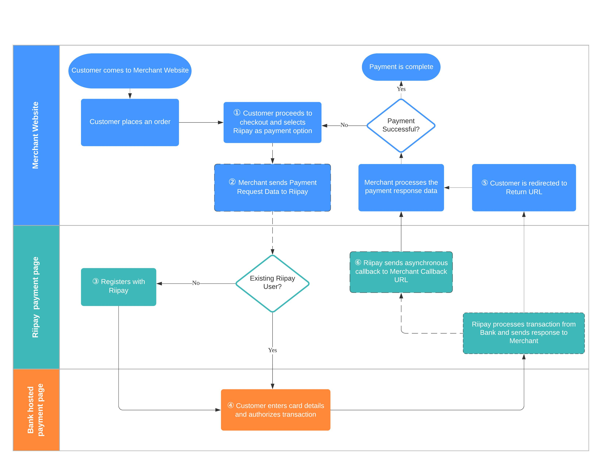

# Overview

A typical payment process can be illustrated in the diagram below:

1. The customer places an order with you. They enter their details, and select Riipay as their payment option.
2. The customer will then be redirected to Riipay payment page with all the required request data using a GET request. Riipay will verify the signature value in the request data.
3. If the customer has not used Riipay before, they will be asked to fill in basic information.
4. Then, they will be redirected to bank hosted payment page to pay for the order.
5. The customer that completes the payment will then be redirected to your return URL with all the response data. You will have to verify the signature value in the response data.
6. Riipay will also send a callback request asynchronously to your callback URL with the same response data. This ensures that orders can be completed even in cases where the customer's connection is terminated prematurely. The form of callback requests would be the same as what you configured on Riipay Merchant Portal dashboard.
7. The transaction is complete and you may show the customer a thank-you page.
8. If the transaction fails, the customer will need to retry payment by repeating the whole process.

